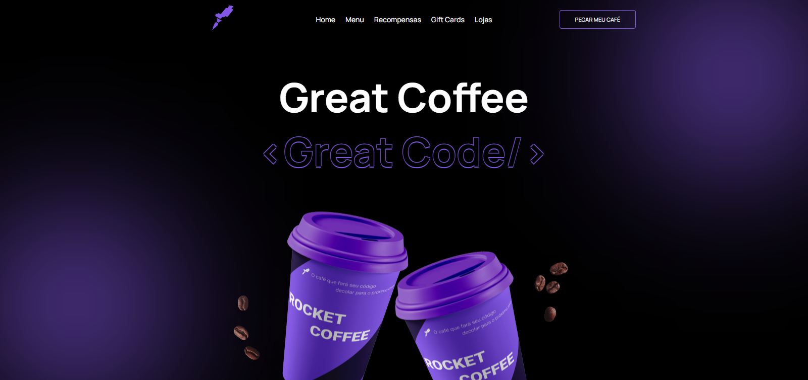

<h1>RocketCoffee</h1>

Challenge created by Rocketseat :purple_heart:

The purpose of this content is to create an <strong>HTML/CSS</strong> homepage for a coffee brand. We also use <strong>Javascript</strong> to manipulate elements.

<h2>We use it in the project</h2>

In addition to all the necessary base, we use some knowledge such as:

<ul>
<li>Flexbox</li>
<li>CSS variables</li>
<li>Relative unit (rem)</li>
<li>Pseudo elements</li>
</ul>

-- Developed by <a href="https://github.com/juninhomorais/">Juninho Morais</a>
